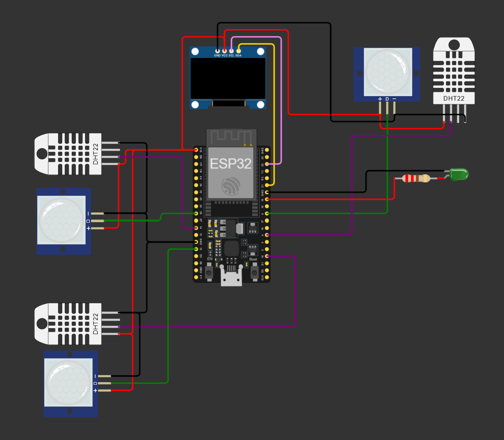
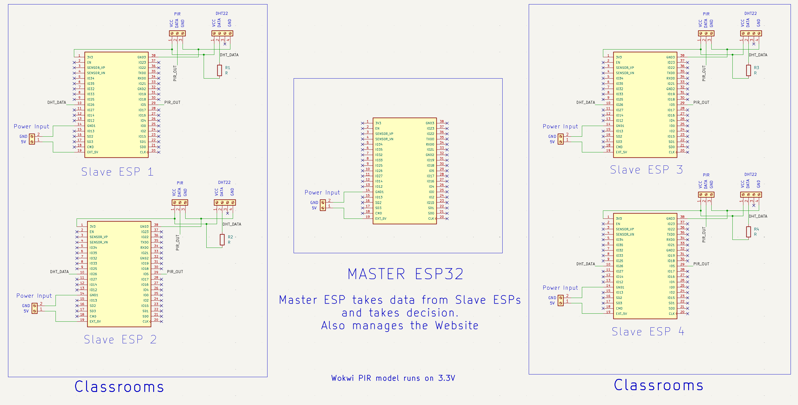

# Smart Classroom Comfort & Reallocation System (SCCRS)

> An ESP32-based IoT concept for classroom comfort monitoring, automated ventilation, occupancy awareness, and future smart classroom allocation.

---

## Overview

The **Smart Classroom Comfort & Reallocation System (SCCRS)** is an IoT-based system designed to monitor classroom conditions and occupancy while enabling automated ventilation control and centralized classroom monitoring.

The system uses:

- **DHT22** sensors for temperature and humidity monitoring
- **PIR** sensors for occupancy/motion detection
- **ESP32** microcontrollers for processing and control
- **ESP-NOW** for communication in the proposed real-world distributed architecture
- A web-based dashboard for monitoring system information

The project consists of two architectures:

1. **Wokwi Simulation Prototype** — a single ESP32 controls three simulated classrooms.
2. **Real-World Implementation Architecture** — each classroom has its own ESP32 and communicates with a central Master ESP32 using ESP-NOW.

---

## Problem Statement

Classrooms can experience unnecessary energy consumption and poor environmental comfort when ventilation is not adapted to actual room conditions.

At the same time, institutions may not have a simple way to determine which classrooms are occupied or available.

SCCRS explores an IoT-based approach that combines:

- Occupancy information
- Environmental monitoring
- Automated ventilation
- Centralized classroom status

---

## Proposed Solution

The system continuously monitors classroom conditions using distributed sensor nodes.

A classroom node collects:

- Temperature
- Humidity
- Occupancy/motion information

The collected information can then be used to determine the appropriate ventilation state and provide classroom status information to the central monitoring system.

---

# System Architecture

## Wokwi Prototype

The Wokwi prototype uses **one ESP32 to represent three classrooms**.

Each simulated classroom contains:

- 1 × DHT22
- 1 × PIR sensor
- 1 × ventilation indicator

```text
                  ESP32
                    |
        +-----------+-----------+
        |           |           |
        V           V           V
     Room 1      Room 2      Room 3
        |           |           |
     DHT22        DHT22        DHT22
     PIR          PIR          PIR
     Fan LED      Fan LED      Fan LED
```

This architecture is used to demonstrate the system's core control logic in Wokwi.

### Wokwi Simulation

**Simulation link:** [Open Wokwi Simulation](./simulation/wokwi-link.md)



---

# Real-World Architecture

The intended real-world implementation uses a distributed architecture.

Each classroom contains an independent ESP32 room node.

```text
                 +----------------+
                 |  Master ESP32  |
                 +-------+--------+
                         |
                     ESP-NOW
              +----------+----------+
              |          |          |
              V          V          V
          Room Node   Room Node   Room Node
             1           2           3
```

Each room node consists of:

- ESP32
- DHT22
- PIR sensor
- Ventilation control output

The Master ESP32 acts as the central coordinator and communicates with the individual room nodes.

### Real-World Schematic



Detailed information is available in:

**[Real-World Implementation Documentation](./implementation/README.md)**

---

# System Workflow

```text
PIR Sensor
    |
    V
Occupancy Detection
    |
    V
DHT22 Temperature Reading
    |
    V
Condition Evaluation
    |
    V
Ventilation Decision
    |
    V
Room Status
    |
    V
Central Monitoring / Dashboard
```

The system can use occupancy and environmental conditions together when determining ventilation requirements.

---

# Dashboard

A web dashboard is included as part of the project.

The dashboard is intended to provide a visual interface for displaying classroom information and system status.

Current dashboard implementation:

```text
dashboard/
└── index.html
```

---

# Technologies

| Category | Technology |
|---|---|
| Microcontroller | ESP32 |
| Temperature & Humidity | DHT22 |
| Occupancy Detection | PIR |
| Wireless Communication | ESP-NOW |
| Simulation | Wokwi |
| Firmware | Arduino / C++ |
| Dashboard | HTML |
| Hardware Design | KiCad |

---

# Repository Structure

```text
Smart-Classroom-Comfort-Reallocation-System/
│
├── README.md
├── LICENSE
│
├── docs/
│   ├── project-overview.md
│   ├── system-workflow.md
│   └── future-scope.md
│
├── simulation/
│   ├── classroom_controller.ino
│   ├── wokwi-diagram.png
│   ├── wokwi-schematic.png
│   └── wokwi-link.md
│
├── implementation/
│   ├── README.md
│   └── real-world-schematic.png
│
└── dashboard/
    └── index.html
```

---

# Project Status

| Component | Status |
|---|---|
| System concept | Designed |
| Wokwi simulation | Implemented |
| Wokwi firmware | Implemented |
| Wokwi schematic | Available |
| Real-world architecture | Designed |
| Real-world schematic | Available |
| Dashboard | Implemented |
| Distributed ESP-NOW hardware deployment | Future implementation |

---

# Future Scope

The system can be extended beyond the current prototype with:

- Additional classroom nodes
- CO₂ and air-quality monitoring
- Energy consumption monitoring
- Cloud connectivity
- Mobile application
- Historical occupancy analytics
- Automated classroom allocation
- Predictive classroom utilization

The long-term goal is to develop the system into a scalable **smart classroom and smart campus infrastructure platform**.

---

# License

This project is licensed under the **MIT License**.

See [`LICENSE`](./LICENSE) for details.